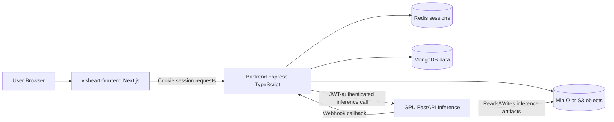

# COS40005FYPA Codebase Guide

This document explains the repository structure, what each major folder/file does, and how the full VisHeart architecture works end-to-end.

Scope:
- Repository root: COS40005FYPA
- Main monorepo folder: cardiac-component-segmentation-ai
- Subsystems: Backend API, Frontend UI, GPU Inference, Local Docker deployment

## 1) Top-level workspace structure

### Root folder: COS40005FYPA
- README.md
  - Team workflow document (branching strategy and sprint branch list).
- cardiac-component-segmentation-ai/
  - Main monorepo for the application stack.

## 2) Monorepo root: cardiac-component-segmentation-ai

Purpose:
- Holds all runtime components required by VisHeart.
- Includes convenience launchers and four service modules.

Main files:
- README.md
  - Local deployment quick-start documentation.
- start.bat
  - Root launcher for Windows; delegates startup to visheart-local-deployment/start.bat.
- stop.bat
  - Root stop script for Windows; delegates shutdown to visheart-local-deployment/stop.bat.
- LICENSE
  - Repository license.

Main folders:
- Cardiac_Segmentation_FYP_Server/
- visheart-frontend/
- visheart-inference-gpu/
- visheart-local-deployment/

## 3) Backend service: Cardiac_Segmentation_FYP_Server

### Role in architecture
This is the central orchestration and business-logic layer.
It handles:
- User authentication and session management
- Project CRUD and file metadata
- S3/MinIO object interactions
- Segmentation and reconstruction job orchestration
- GPU service JWT delegation and callback handling
- AWS/system metrics routes

### Key root files
- package.json
  - Defines scripts (dev/build/start/test) and all Node dependencies.
- tsconfig.json
  - TypeScript compiler settings.
- Dockerfile
  - Multi-stage Node image build + Python runtime dependencies.
- ecosystem.config.js
  - PM2 process config.
- jest.config.js
  - Unit/integration test config.
- eslint.config.mjs
  - Lint rules.
- cors-config.json
  - CORS-related local config.
- README.md
  - API reference and route descriptions.
- README_SEGMENTATION.md
  - Segmentation-specific backend docs.
- README_RECONSTRUCTION.md
  - Reconstruction-specific backend docs.
- README_AWS-METRICS.md
  - AWS metrics endpoints docs.

### Backend source tree: src/

#### src/index.ts
- Backend process entrypoint.
- Startup lifecycle:
  1. Load env
  2. Connect Redis
  3. Connect MongoDB
  4. Initialize GPU auth token refresh
  5. Run affine migration if needed
  6. Start Express HTTP server
  7. Schedule cleanup cron jobs
- Also handles graceful shutdown.

#### src/services/
Core business/services layer.
- express_app.ts
  - Creates Express app.
  - Configures JSON parsing, session middleware, Passport, CORS, Helmet.
  - Mounts all route modules.
- database.ts
  - Mongoose schemas/models and CRUD operations.
  - Creates default admin account if absent.
  - Seeds GPU host config.
  - Includes cascade delete behavior for user-owned project data.
- redis.ts
  - Redis client setup, connect, health checks.
- passportjs.ts
  - Passport strategy and auth guards (isAuth, role checks).
- gpu_auth_client.ts
  - Backend-to-GPU JWT generation/refresh.
  - Loads GPU host config from DB (with env fallback).
- inference.ts
  - Segmentation orchestration logic to GPU service.
- reconstruction.ts
  - 4D reconstruction orchestration logic to GPU service.
- reconstruction_handler.ts
  - Reconstruction processing helpers.
- project_handler.ts
  - Upload handling, persistence workflow, project-level operations.
- s3_handler.ts
  - Object storage functions (upload/download/delete/url helpers).
- cloudwatch.ts
  - AWS CloudWatch metrics retrieval.
- logger.ts
  - Winston logging setup.
- mesh_processor.ts
  - Mesh/tar handling helpers.
- segmentation_export.ts
  - Segmentation export transformation utilities.

#### src/routes/
HTTP API boundaries.
- authentication.ts
  - Register/login/logout/fetch/update/delete/guest flows.
- project_routes.ts
  - Upload/read/update/save/delete project APIs.
- segmentation_routes.ts
  - Start segmentation, manual segmentation, save/get masks, job status, batch status.
- reconstruction_routes.ts
  - Start reconstruction, get results, batch status, job tracking, delete reconstructions.
- webhook_routes.ts
  - Callback receiver from GPU server (async job completion path).
- gpu_status.ts
  - GPU availability/status proxy route(s).
- admin_tools.ts
  - Admin maintenance/management APIs.
- cpu_metrics.ts, ecr_metrics.ts, s3_metrics.ts, alb_metrics.ts, asg_metrics.ts, billing_metrics.ts
  - Infrastructure/usage/cost observability endpoints.
- sample_nifti.ts
  - Route for sample NIfTI assets.
- debug_routes.ts
  - Development-only debug endpoints.

#### src/middleware/
- uploadmiddleware.ts
  - Validates and filters upload files.
- gpuauthmiddleware.ts
  - Injects backend-generated Bearer token for GPU-bound requests.

#### src/jobs/
Scheduled maintenance tasks.
- guestcleanupjob.ts
  - Cleans stale guest users/data.
- inferencejobcleanupjob.ts
  - Cleans stale/orphaned inference job records.
- projectcleanupjob.ts
  - Handles save/unsave and auto-cleanup policies.

#### src/utils/
Shared utility helpers.
- error_logger.ts
  - Centralized error logging.
- field_validation.ts
  - express-validator field rule sets.
- upload_validation.ts
  - Upload input validation helpers.
- nifti_parser.ts
  - NIfTI parsing metadata helpers.
- s3_presigned_url.ts
  - Presigned URL generation helper.

#### src/types/
- database_types.ts
  - Mongoose/domain model types and enums.
- api_types.ts
  - API-level interface definitions.

#### src/scripts/
- affine_matrix_migration.ts
  - Data migration script for affine matrix consistency.

#### src/python/
Python scripts invoked by backend for medical/image processing.
- convert_to_jpeg.py
  - Converts uploaded image data/slices for visualization.
- extract_metadata.py
  - Extracts image metadata.
- create_nifti_from_segmentations.py
  - Builds NIfTI volumes from segmentation outputs.
- create_nifti_with_stored_affine.py
  - Reconstructs NIfTI while preserving affine matrix.
- convert_npz_to_obj.py
  - Converts NPZ/mesh artifacts to OBJ where needed.
- requirements.txt
  - Python dependencies for backend processing scripts.

#### src/tests/ and __tests__/
- __tests__/...
  - Jest tests for auth and DB behavior.
- src/tests/...
  - Developer test scripts and smoke checks.

#### public/
- sample_nifti/
  - Sample assets for demo/testing paths.

## 4) Frontend service: visheart-frontend

### Role in architecture
Next.js application that provides all user-facing pages:
- Login/guest/user/admin workflows
- Project dashboard and details
- Upload and visualization workflows
- Segmentation and reconstruction interactions
- Metrics/admin views

### Key root files
- package.json
  - Next.js scripts and UI dependencies.
- next.config.ts
  - Next.js runtime/build configuration.
- tsconfig.json
  - TypeScript config.
- postcss.config.mjs
  - CSS post-processing config.
- components.json
  - Shadcn UI generator config.
- ecosystem.config.js
  - PM2 runtime config.
- Dockerfile
  - Frontend container image.
- README.md
  - Frontend architecture and usage docs.

### Frontend source tree: src/

#### src/app/
App Router pages and route segments.
- layout.tsx
  - Root app wrapper.
  - Injects theme provider, auth provider, shared header/footer, and toaster.
- page.tsx
  - Landing page.
- login/, register/
  - Authentication pages.
- dashboard/
  - Main project listing and management page(s).
- project/
  - Project detail pages and nested UI.
- admin/
  - Administrative views.
- profile/, about/, doc/, policy/, sample/
  - User profile and informational/static pages.
- globals.css
  - Global styling tokens and shared CSS.

#### src/context/
- auth-context.tsx
  - Client auth state and methods.
  - Uses backend session cookie + /auth/fetch for status.
- ProjectContext.tsx
  - Project-level shared state for detail pages/components.

#### src/lib/
- api.ts
  - Central axios client with withCredentials=true.
  - Exposes grouped APIs (auth/project/segmentation/reconstruction/metrics/etc).
- dashboard-hooks.ts
  - Dashboard-specific data hooks/state behavior.
- reconstruction-cache.ts, tar-image-cache.ts
  - Client-side caching for heavy artifact workflows.
- decode-RLE.ts
  - Decodes run-length encoded segmentation mask data.
- format-utils.ts, utils.ts
  - General formatting and helper functions.
- theme-provider.tsx
  - Theme handling.
- login.ts
  - Login helper logic.

#### src/components/
Feature and reusable UI components.
- ProtectedRoute.tsx
  - Route guard based on auth/role.
- RoleGuard.tsx
  - Conditional rendering by role.
- LoginForm.tsx, RegistrationForm.tsx
  - Auth forms.
- upload/, project/, dashboard/, segmentation/, reconstruction/, admin/, home/
  - Feature modules for each product area.
- components/ui/
  - Shadcn base UI primitives.

#### src/hooks/
- Custom hooks for data status/polling/feature logic.

#### src/types/
- TS interfaces for API payloads and domain data.

#### src/ui/
- Site shell pieces (header/footer/theme toggle).

#### public/
- Static assets and images used by UI.

## 5) GPU inference service: visheart-inference-gpu

### Role in architecture
High-compute FastAPI service for:
- Cardiac segmentation inference (YOLO + MedSAM)
- Manual segmentation inference variant
- 4D myocardium reconstruction inference
- Async completion callbacks to backend

### Key root files
- app/main.py
  - FastAPI app entrypoint.
  - Loads env, logging, and model lifespans.
  - Mounts /inference/v2 and /status routes.
- start_server.py
  - Local Uvicorn startup script.
- Dockerfile
  - CUDA-enabled multi-stage container.
- requirements_torch.txt, requirements_prod.txt, requirements_dev.txt
  - Python dependency sets by environment.
- 4d-reconstruction-api.md
  - Reconstruction API details.
- README.md
  - Full service and API documentation.

### Inference app tree: app/

#### app/routes/
- inference_route.py
  - Main inference endpoints (v2).
- inference_route_old.py
  - Legacy route compatibility (enabled in development mode).
- status_routes.py
  - Health/status endpoints.

#### app/dependencies/
- model_init.py
  - Lifespan initializers for YOLO, MedSAM, and 4D reconstruction models.
- deep_sdf/, mesh_to_sdf/, networks/
  - Reconstruction/model dependency modules.
- get_P.py
  - Reconstruction support logic.

#### app/classes/
- yolo_handler.py
  - YOLO inference integration.
- medsam_handler.py
  - MedSAM segmentation logic.
- fourdreconstruction_handler.py
  - 4D reconstruction pipeline logic.
- file_fetch_handler.py
  - Downloads/prepares input files.
- pydantic_schema.py
  - Request/response schemas.

#### app/helpers/
- inference_helpers.py, inference_jobs.py
  - Shared helper logic for asynchronous inference execution.

#### app/security/
- backend_authentication.py
  - JWT auth/validation for backend-originating calls.

#### app/models/
- Model artifacts (YOLO engine/PT, MedSAM checkpoint, 4D model).

#### app/scripts/
- Utility scripts for conversion/testing/support operations.

#### app/utils/
- Logging and shared utility modules.

## 6) Local deployment stack: visheart-local-deployment

### Role in architecture
Provides one-command local startup for the full stack via Docker Compose.
This is the deployment glue used in local demos/development.

### Key files
- docker-compose.yml
  - Orchestrates containers:
    - visheart-app (combined frontend + backend image)
    - mongodb
    - redis
    - minio + minio-setup bucket initializer
    - gpu inference service
  - Defines ports, env vars, healthchecks, and network.
- start.ps1 / start.bat
  - Startup automation scripts for Windows.
  - Handles Docker checks and host-file mapping for minio local host.
- stop.ps1 / stop.bat
  - Stop/cleanup scripts.
- build.ps1
  - Builds combined local application image.
- Dockerfile
  - Combined app image build definition.
- volumes/
  - Persistent local data mounts (Mongo/Redis state).

## 7) How the architecture works end-to-end

## Logical components
1. Browser client (visheart-frontend)
2. API gateway/business logic (Cardiac_Segmentation_FYP_Server)
3. Compute worker (visheart-inference-gpu)
4. Data stores (MongoDB, Redis, MinIO/S3)

## Runtime data flow

### A) Authentication flow
1. Frontend sends login/register/guest call to backend auth routes.
2. Backend authenticates via Passport.
3. Session is persisted in Redis using express-session + connect-redis.
4. Browser keeps session cookie; frontend uses withCredentials requests.

### B) Project upload flow
1. User uploads NIfTI/archive via frontend.
2. Backend upload middleware validates file.
3. Backend project handler stores source file in S3/MinIO.
4. Backend extracts metadata and persists project record in MongoDB.
5. Frontend dashboard fetches project list and renders status.

### C) Segmentation inference flow
1. User starts segmentation from frontend.
2. Backend route verifies auth and obtains fresh GPU JWT via gpuauthmiddleware.
3. Backend service sends inference request to GPU API.
4. GPU service executes model pipeline (YOLO + MedSAM).
5. GPU callback/webhook informs backend of completion.
6. Backend stores segmentation masks/job states in MongoDB and S3 as needed.
7. Frontend polls job/status endpoints and fetches results.

### D) Reconstruction flow
1. User triggers reconstruction for a project.
2. Backend sends job request to GPU reconstruction endpoint.
3. GPU service runs temporal 4D reconstruction and exports mesh artifacts.
4. Results are stored and linked in backend records.
5. Frontend fetches reconstruction metadata and presigned download URLs.

### E) Background maintenance flow
1. Cron jobs in backend clean stale guest users and old/orphaned jobs.
2. Save/unsave policies prevent unbounded storage accumulation.

## Architecture diagram (conceptual)

## 8) Design patterns present in this codebase

- Service-layer backend
  - Routes are mostly thin; core logic is in src/services.
- Session-based auth for users
  - Cookie + Redis session store instead of user JWT at frontend.
- Separate machine-to-machine auth for GPU communication
  - Backend self-generates JWTs for GPU calls.
- Async job style processing
  - Long-running inference/reconstruction decoupled via callback + polling.
- Polyglot processing
  - Node API orchestration + Python scripts for imaging tasks.
- Container-first local environment
  - Reproducible stack startup with Docker Compose.

## 9) What to read first if you are onboarding

Suggested order:
1. cardiac-component-segmentation-ai/README.md
2. Cardiac_Segmentation_FYP_Server/src/index.ts
3. Cardiac_Segmentation_FYP_Server/src/services/express_app.ts
4. Cardiac_Segmentation_FYP_Server/src/routes/segmentation_routes.ts
5. visheart-frontend/src/lib/api.ts
6. visheart-frontend/src/context/auth-context.tsx
7. visheart-inference-gpu/app/main.py
8. visheart-local-deployment/docker-compose.yml

This sequence gives you architecture, request entrypoints, cross-service integration, and deployment behavior quickly.
