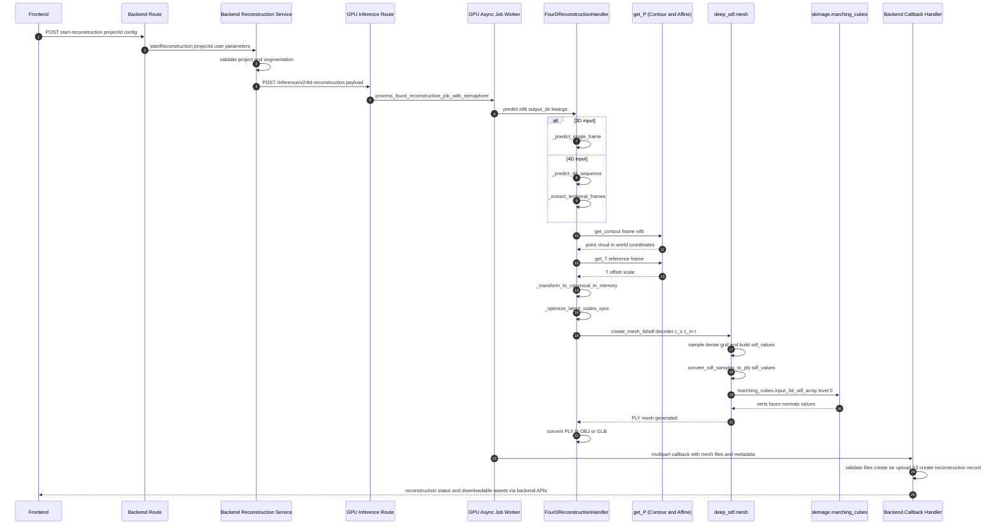
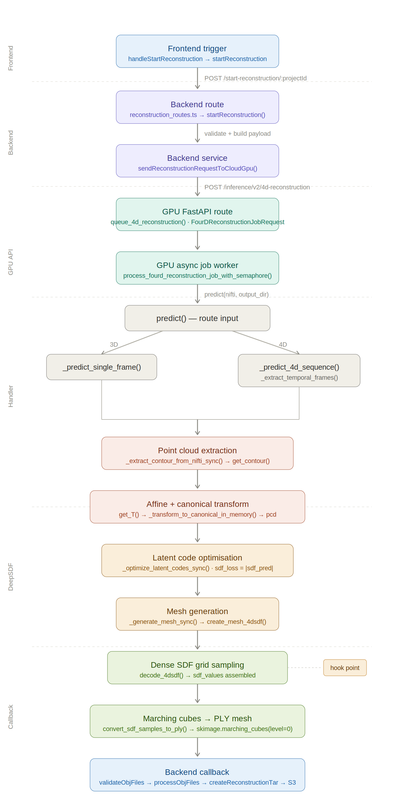

# 4D Reconstruction Pipeline Review (Codebase Documentation)

This document summarizes the current 4D reconstruction pipeline implementation in this repository, including function-level traceability and exact extraction points for point cloud and SDF data before marching cubes.

## Scope

Reviewed modules:
- Frontend trigger path
- Backend orchestration and GPU job submission
- GPU API endpoint and async job execution
- 4D reconstruction handler internals
- DeepSDF mesh generation internals
- Backend callback post-processing

## End-to-End Flow (Function and File References)

### 1) Frontend starts reconstruction

- `handleStartReconstruction` in [visheart-frontend/src/app/project/[projectId]/page.tsx](visheart-frontend/src/app/project/[projectId]/page.tsx#L409)
- `startReconstruction` API client in [visheart-frontend/src/lib/api.ts](visheart-frontend/src/lib/api.ts#L415)

### 2) Backend route receives request

- Route: `POST /start-reconstruction/:projectId`
- Handler in [Cardiac_Segmentation_FYP_Server/src/routes/reconstruction_routes.ts](Cardiac_Segmentation_FYP_Server/src/routes/reconstruction_routes.ts#L29)
- Calls `startReconstruction(...)` in [Cardiac_Segmentation_FYP_Server/src/services/reconstruction.ts](Cardiac_Segmentation_FYP_Server/src/services/reconstruction.ts#L114)

### 3) Backend service prepares and submits GPU job

In [Cardiac_Segmentation_FYP_Server/src/services/reconstruction.ts](Cardiac_Segmentation_FYP_Server/src/services/reconstruction.ts):
- `startReconstruction(...)` validates project and segmentation context, creates payload, and tracks job metadata.
- `sendReconstructionRequestToCloudGpu(...)` posts to GPU endpoint [Cardiac_Segmentation_FYP_Server/src/services/reconstruction.ts](Cardiac_Segmentation_FYP_Server/src/services/reconstruction.ts#L25)
- Endpoint target: `/inference/v2/4d-reconstruction` [Cardiac_Segmentation_FYP_Server/src/services/reconstruction.ts](Cardiac_Segmentation_FYP_Server/src/services/reconstruction.ts#L52)
- Actual submission call [Cardiac_Segmentation_FYP_Server/src/services/reconstruction.ts](Cardiac_Segmentation_FYP_Server/src/services/reconstruction.ts#L256)

### 4) GPU FastAPI route accepts async job

- Route handler `queue_4d_reconstruction(...)` in [visheart-inference-gpu/app/routes/inference_route.py](visheart-inference-gpu/app/routes/inference_route.py#L222)
- Uses request model `FourDReconstructionJobRequest` in [visheart-inference-gpu/app/classes/pydantic_schema.py](visheart-inference-gpu/app/classes/pydantic_schema.py#L148)

### 5) GPU async job worker executes reconstruction

In [visheart-inference-gpu/app/helpers/inference_jobs.py](visheart-inference-gpu/app/helpers/inference_jobs.py):
- `process_fourd_reconstruction_job_with_semaphore(...)` [visheart-inference-gpu/app/helpers/inference_jobs.py](visheart-inference-gpu/app/helpers/inference_jobs.py#L697)
- `_process_fourd_reconstruction_job(...)` [visheart-inference-gpu/app/helpers/inference_jobs.py](visheart-inference-gpu/app/helpers/inference_jobs.py#L713)
- Callback helpers:
  - `send_callback_with_files(...)` [visheart-inference-gpu/app/helpers/inference_jobs.py](visheart-inference-gpu/app/helpers/inference_jobs.py#L99)
  - `send_callback(...)` [visheart-inference-gpu/app/helpers/inference_jobs.py](visheart-inference-gpu/app/helpers/inference_jobs.py#L193)

### 6) Model lifecycle and dependency injection

In [visheart-inference-gpu/app/dependencies/model_init.py](visheart-inference-gpu/app/dependencies/model_init.py):
- `fourd_reconstruction_model_lifespan(...)` [visheart-inference-gpu/app/dependencies/model_init.py](visheart-inference-gpu/app/dependencies/model_init.py#L118)
- `get_fourd_reconstruction_model(...)` [visheart-inference-gpu/app/dependencies/model_init.py](visheart-inference-gpu/app/dependencies/model_init.py#L148)

Lifespan composition in [visheart-inference-gpu/app/main.py](visheart-inference-gpu/app/main.py).

## Reconstruction Core: Function-Level Pipeline

Main class: `FourDReconstructionHandler` in [visheart-inference-gpu/app/classes/fourdreconstruction_handler.py](visheart-inference-gpu/app/classes/fourdreconstruction_handler.py)

### Entry points

- `predict(...)` routes input to single-frame or 4D-sequence path [visheart-inference-gpu/app/classes/fourdreconstruction_handler.py](visheart-inference-gpu/app/classes/fourdreconstruction_handler.py#L760)
- `_predict_single_frame(...)` [visheart-inference-gpu/app/classes/fourdreconstruction_handler.py](visheart-inference-gpu/app/classes/fourdreconstruction_handler.py#L775)
- `_predict_4d_sequence(...)` [visheart-inference-gpu/app/classes/fourdreconstruction_handler.py](visheart-inference-gpu/app/classes/fourdreconstruction_handler.py#L876)

### Input handling and temporal extraction

- `_detect_nifti_dimensions(...)` [visheart-inference-gpu/app/classes/fourdreconstruction_handler.py](visheart-inference-gpu/app/classes/fourdreconstruction_handler.py#L257)
- `_extract_temporal_frames(...)` [visheart-inference-gpu/app/classes/fourdreconstruction_handler.py](visheart-inference-gpu/app/classes/fourdreconstruction_handler.py#L284)

### Point cloud extraction

- `_extract_contour_from_nifti_sync(...)` [visheart-inference-gpu/app/classes/fourdreconstruction_handler.py](visheart-inference-gpu/app/classes/fourdreconstruction_handler.py#L345)
- Calls `get_contour(...)` in [visheart-inference-gpu/app/dependencies/get_P.py](visheart-inference-gpu/app/dependencies/get_P.py#L108)

Pipeline call sites where point cloud is extracted:
- Single-frame path: `point_cloud = self._extract_contour_from_nifti_sync(...)` [visheart-inference-gpu/app/classes/fourdreconstruction_handler.py](visheart-inference-gpu/app/classes/fourdreconstruction_handler.py#L808)
- 4D all-frames path: `frame_point_cloud = self._extract_contour_from_nifti_sync(...)` [visheart-inference-gpu/app/classes/fourdreconstruction_handler.py](visheart-inference-gpu/app/classes/fourdreconstruction_handler.py#L1011)
- 4D ED-only path: `ed_point_cloud = self._extract_contour_from_nifti_sync(...)` [visheart-inference-gpu/app/classes/fourdreconstruction_handler.py](visheart-inference-gpu/app/classes/fourdreconstruction_handler.py#L1089)

### Affine and canonical-space transformation

- `_extract_affine_matrix_sync(...)` [visheart-inference-gpu/app/classes/fourdreconstruction_handler.py](visheart-inference-gpu/app/classes/fourdreconstruction_handler.py#L367)
- Calls `get_T(...)` in [visheart-inference-gpu/app/dependencies/get_P.py](visheart-inference-gpu/app/dependencies/get_P.py#L308)
- `_transform_to_canonical_in_memory(...)` [visheart-inference-gpu/app/classes/fourdreconstruction_handler.py](visheart-inference-gpu/app/classes/fourdreconstruction_handler.py#L401)
- Canonical point-cloud SDF container creation:
  - `pcd = np.concatenate((pos_xyz, pos_sdf), axis=1)` [visheart-inference-gpu/app/classes/fourdreconstruction_handler.py](visheart-inference-gpu/app/classes/fourdreconstruction_handler.py#L431)

### Latent optimization

- `_optimize_latent_codes_sync(...)` [visheart-inference-gpu/app/classes/fourdreconstruction_handler.py](visheart-inference-gpu/app/classes/fourdreconstruction_handler.py#L451)
- Input tensors from canonical pcd:
  - `pcd = sdf_data['pcd']` [visheart-inference-gpu/app/classes/fourdreconstruction_handler.py](visheart-inference-gpu/app/classes/fourdreconstruction_handler.py#L492)
  - `sdf_gt = ... pcd[:, 3]` [visheart-inference-gpu/app/classes/fourdreconstruction_handler.py](visheart-inference-gpu/app/classes/fourdreconstruction_handler.py#L497)
- Decoder forward in optimization:
  - `new_xyz, sdf_pred = self.decoder(...)` [visheart-inference-gpu/app/classes/fourdreconstruction_handler.py](visheart-inference-gpu/app/classes/fourdreconstruction_handler.py#L540)
- Surface-fitting loss currently used:
  - `sdf_loss = torch.mean(torch.abs(sdf_pred))` [visheart-inference-gpu/app/classes/fourdreconstruction_handler.py](visheart-inference-gpu/app/classes/fourdreconstruction_handler.py#L544)

### Mesh generation

- `_generate_mesh_sync(...)` [visheart-inference-gpu/app/classes/fourdreconstruction_handler.py](visheart-inference-gpu/app/classes/fourdreconstruction_handler.py#L603)
- Calls `deep_sdf.mesh.create_mesh_4dsdf(...)` [visheart-inference-gpu/app/classes/fourdreconstruction_handler.py](visheart-inference-gpu/app/classes/fourdreconstruction_handler.py#L658)

## DeepSDF Mesh Sampling and Marching Cubes

In [visheart-inference-gpu/app/dependencies/deep_sdf/mesh.py](visheart-inference-gpu/app/dependencies/deep_sdf/mesh.py):

- `create_mesh_4dsdf(...)` [visheart-inference-gpu/app/dependencies/deep_sdf/mesh.py](visheart-inference-gpu/app/dependencies/deep_sdf/mesh.py#L11)
- Dense grid SDF accumulation:
  - `sdf_values = samples[:, 3]` [visheart-inference-gpu/app/dependencies/deep_sdf/mesh.py](visheart-inference-gpu/app/dependencies/deep_sdf/mesh.py#L51)
- Immediate handoff before marching cubes:
  - `convert_sdf_samples_to_ply(sdf_values, ...)` [visheart-inference-gpu/app/dependencies/deep_sdf/mesh.py](visheart-inference-gpu/app/dependencies/deep_sdf/mesh.py#L62)
- Marching cubes call:
  - `skimage.measure.marching_cubes(...)` in `convert_sdf_samples_to_ply(...)` [visheart-inference-gpu/app/dependencies/deep_sdf/mesh.py](visheart-inference-gpu/app/dependencies/deep_sdf/mesh.py#L272)

Related decoder helper:
- `decode_4dsdf(...)` in [visheart-inference-gpu/app/dependencies/deep_sdf/utils.py](visheart-inference-gpu/app/dependencies/deep_sdf/utils.py#L67)

## Exact Data Extraction Points

### Point cloud extraction point (already implemented)

- Primary source: `get_contour(...)` in [visheart-inference-gpu/app/dependencies/get_P.py](visheart-inference-gpu/app/dependencies/get_P.py#L108)
- Handler-level extraction wrapper: `_extract_contour_from_nifti_sync(...)` in [visheart-inference-gpu/app/classes/fourdreconstruction_handler.py](visheart-inference-gpu/app/classes/fourdreconstruction_handler.py#L345)

### SDF right before marching cubes

Exact pre-marching-cubes stage is in `create_mesh_4dsdf(...)`:
- `sdf_values` is assembled as a dense volume from batched decoder predictions [visheart-inference-gpu/app/dependencies/deep_sdf/mesh.py](visheart-inference-gpu/app/dependencies/deep_sdf/mesh.py#L51)
- This tensor is passed into `convert_sdf_samples_to_ply(...)` [visheart-inference-gpu/app/dependencies/deep_sdf/mesh.py](visheart-inference-gpu/app/dependencies/deep_sdf/mesh.py#L62)
- Marching cubes runs inside `convert_sdf_samples_to_ply(...)` [visheart-inference-gpu/app/dependencies/deep_sdf/mesh.py](visheart-inference-gpu/app/dependencies/deep_sdf/mesh.py#L272)

If instrumentation is needed, best hook points are:
- Immediately before [visheart-inference-gpu/app/dependencies/deep_sdf/mesh.py](visheart-inference-gpu/app/dependencies/deep_sdf/mesh.py#L62)
- Or at the beginning of `convert_sdf_samples_to_ply(...)` [visheart-inference-gpu/app/dependencies/deep_sdf/mesh.py](visheart-inference-gpu/app/dependencies/deep_sdf/mesh.py#L244)

## Backend Callback and Persistence of Reconstruction Outputs

In [Cardiac_Segmentation_FYP_Server/src/services/reconstruction_handler.ts](Cardiac_Segmentation_FYP_Server/src/services/reconstruction_handler.ts):

- `processReconstructionCallback(...)` [Cardiac_Segmentation_FYP_Server/src/services/reconstruction_handler.ts](Cardiac_Segmentation_FYP_Server/src/services/reconstruction_handler.ts#L76)
- Validation and processing utilities:
  - `validateObjFiles(...)` [Cardiac_Segmentation_FYP_Server/src/services/reconstruction_handler.ts](Cardiac_Segmentation_FYP_Server/src/services/reconstruction_handler.ts#L412)
  - `processObjFiles(...)` [Cardiac_Segmentation_FYP_Server/src/services/reconstruction_handler.ts](Cardiac_Segmentation_FYP_Server/src/services/reconstruction_handler.ts#L462)
  - `createReconstructionTar(...)` [Cardiac_Segmentation_FYP_Server/src/services/reconstruction_handler.ts](Cardiac_Segmentation_FYP_Server/src/services/reconstruction_handler.ts#L542)

## Notes from Review

- Point cloud extraction is present and active in current code paths.
- Current optimization objective behaves like surface fitting (SDF values around zero on sampled points) rather than full signed-distance supervision.
- In callback metadata construction, one path currently hardcodes mesh format to obj in [visheart-inference-gpu/app/helpers/inference_jobs.py](visheart-inference-gpu/app/helpers/inference_jobs.py#L787).

## Suggested Follow-Up Documentation

Recommended future doc additions:
- Input/output tensor shapes per function (especially around `_transform_to_canonical_in_memory`, `_optimize_latent_codes_sync`, `create_mesh_4dsdf`)
- Frame-by-frame naming conventions and ED frame selection behavior
- Error taxonomy for apex/base frames with no LVM label

## Mermaid Sequence Diagram

### Diagram Notes

- The exact stage immediately before marching cubes is dense SDF volume assembly in `create_mesh_4dsdf(...)`, right before `convert_sdf_samples_to_ply(...)` calls `marching_cubes(...)`.
- Point cloud extraction occurs before latent optimization using `get_contour(...)`, then transformed to canonical space in `_transform_to_canonical_in_memory(...)`.

